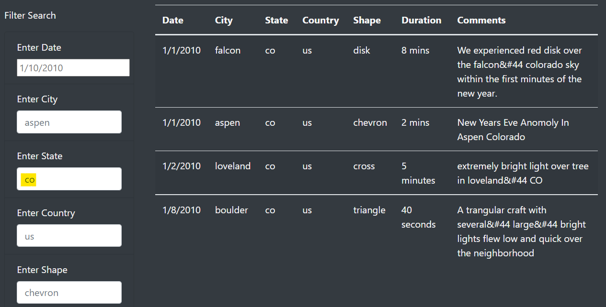

# UFOs

## UFO Sightings

UFO Sightings was desinged to provide records of UFO sightings for curious researchers lookng to find out more about what could be out there in the universe. Users can filter through different criteria such as date of sighting, location, and shape of UFO.

## Example

Let's say I saw a UFO while camping in Colorado and I wanted to know if there have been any other sightings near me. I can search "co" in the state search bar and see there have been four other UFO sightings.  

## Features

The website has a very easy to use interface with great information. One drawback of the website is the searches are limited to exact matches. If a user was to enter the state as "colorado" instead of "co" they would not get any results. In the future I plan to incorporate a search that will return the same results for different variations of the intented search.